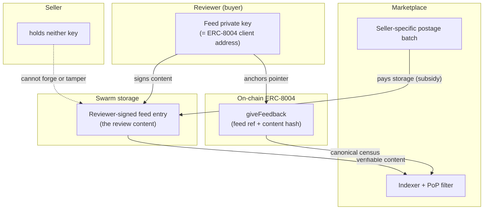
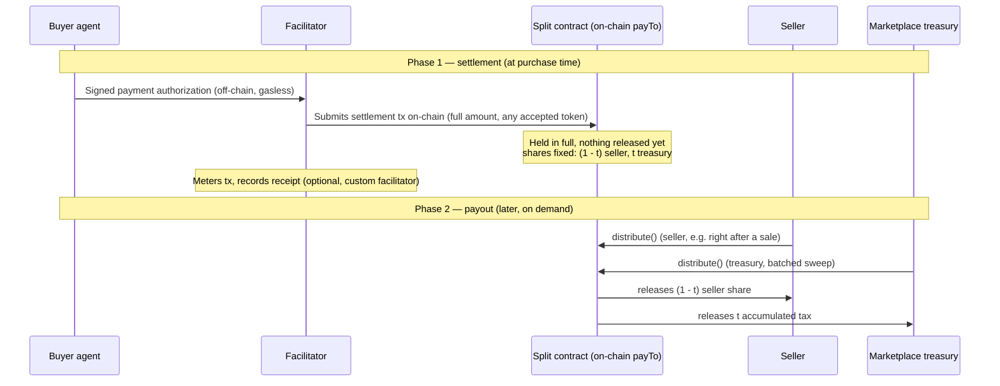
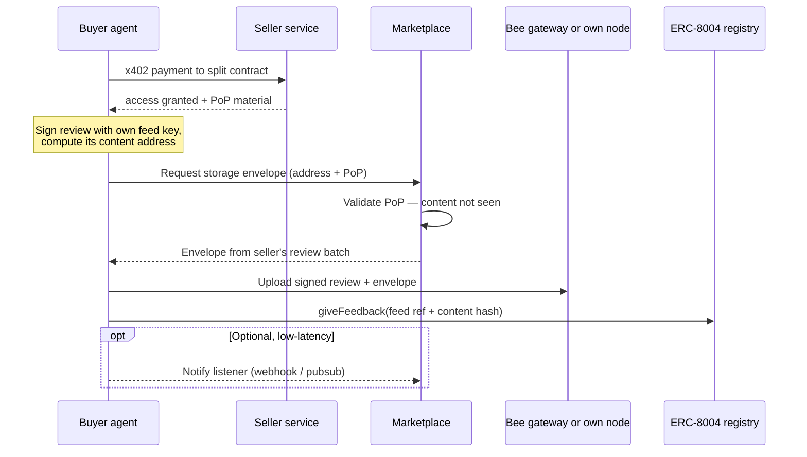
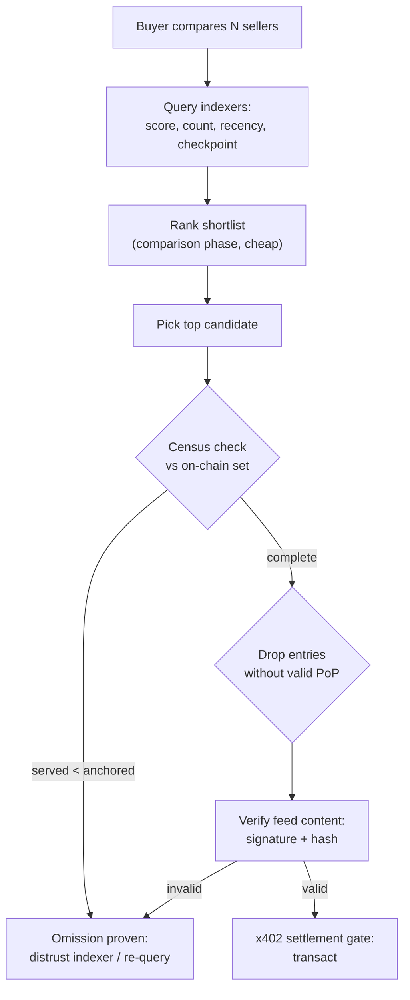

# Data-Enriched AI Marketplaces — Swarm Reputation

_How buyer agents get a verifiable, Sybil-resistant reputation signal for seller agents — by binding reviews to real purchases, storing them under reviewers' own sovereign Swarm feeds, and anchoring them on-chain so neither the marketplace nor the seller can forge, edit, or silently drop one._

---

## Keystone: signing key ≠ postage stamp

A Swarm feed update is a Single Owner Chunk — its address and signature derive from the **owner's key**, while **who pays to store it** is a separate postage batch. Bee can upload a chunk signed by one party under a stamp owned by another. That single separation lets three otherwise-competing goals hold at once:

| Concern                             | Held by               | Basis                                                                                  |
| ----------------------------------- | --------------------- | -------------------------------------------------------------------------------------- |
| **Authorship & content**            | Reviewer              | Reviewer's feed key signs the SOC — sovereign, unforgeable, un-editable by anyone else |
| **Storage (zero-cost to reviewer)** | Marketplace (subsidy) | Marketplace's postage batch pays; never touches authorship                             |
| **Anti-tamper**                     | —                     | Seller holds _neither_ key → can't forge content, can't alter the stamp                |

The reviewer's feed key is their own Ethereum identity (wallet via EIP-1193, or a session key it authorizes) — the **same address that appears as the client in their on-chain ERC-8004 feedback** — so feed authorship and on-chain identity are one and the same, and trivially cross-checkable. One caveat: a delegated session key signs under _its own_ address, not the wallet's, so to preserve that equality the session key must either be the address that posts the feedback or be tied to the wallet by an on-chain delegation the verifier can follow.

---

## Core principle

Three acts, three owners — none of them a marketplace gatekeeper:

| Act                       | Owner                              | Mechanism                                                                                                           |
| ------------------------- | ---------------------------------- | ------------------------------------------------------------------------------------------------------------------- |
| **Authorship**            | Reviewer                           | Reviewer-signed feed update (SOC)                                                                                   |
| **Publication (pointer)** | Reviewer                           | Reviewer's own on-chain `giveFeedback` carries the feed reference + hash — permissionless, no marketplace mediation |
| **Persistence**           | Marketplace (subsidized) or anyone | Postage stamp — separate from the signing key, re-stampable by anyone                                               |

There is no write-time "inclusion" step. A seller's review set is the union of reviewer feeds discoverable from on-chain feedback events; anyone reading the chain computes the identical set. The marketplace can _add_ curation and _fund_ persistence, but cannot subtract a review from the canonical set.

---

## Foundational rules

**Rule A — On-chain anchoring doubles as the discovery layer.** Each review's feed reference + content hash live in the reviewer's on-chain ERC-8004 feedback entry (`feedbackURI` + `feedbackHash`). The canonical "who reviewed seller X, and where" set is therefore enumerable from chain, independent of any marketplace index; and if persistence later lapses, the hash survives while the content stops resolving — making expiry and omission per-review detectable by anyone.

**Rule B — Proof-of-Purchase is the Sybil filter the registry outsources.** ERC-8004 has no on-chain authorization beyond "submitter is not the agent owner," and `getSummary` requires an explicit client-address set specifically so aggregators supply Sybil resistance. Proof-of-Purchase (PoP) is that mechanism: the marketplace publishes the PoP-validated client-address set per listing for Sybil-resistant summaries. PoP also gates the storage subsidy. What this defends against is the core weakness of raw ERC-8004 reviews: spam, sybils, paid shills, and injected or tampered reviews from parties who never actually transacted. Anyone can write a feed and post matching on-chain feedback — nothing can keep junk out of _existence_ — but only reviews bound to a real, taxed purchase carry PoP, so unknown-source reviews are weightless to every honest reader.

**Rule C — A review counts only if it is anchored _and_ PoP-valid.** Two independent bars must both be cleared. _Anchoring_ (Rule A) means a corresponding on-chain `giveFeedback` entry exists — this proves the review is real and discoverable; feed-only reviews with no anchor are unverifiable hearsay and excluded. _PoP-validity_ (Rule B) means the review is bound to a genuine purchase — this proves it deserves weight; an anchored review with no PoP is visible on-chain but reputationally weightless. Anchoring alone is not sufficient: a spammer can self-fund storage _and_ post an on-chain entry, so the discoverability bar must be paired with the purchase bar. Anchoring makes the on-chain feedback set the **canonical census** (so completeness and omission are checkable); PoP decides which of those entries actually count. The feed stores the rich content; the chain makes it discoverable; PoP authorizes it to count.

---

## Mechanism flow

### Step 1 — Marketplace setup

The operator deploys the marketplace, sets the sales-tax rate and review criteria (PoP rules; thresholds for N reviews, M independent buyers, value floor), provisions a treasury for storage subsidies, and runs or designates an x402 facilitator and a PoP-filtered indexer.

### Step 2 — Seller onboarding & listing

The seller registers an ERC-8004 identity (Agent Card hosted on Swarm), publishes a listing, and registers a split contract as its x402 `payTo` so the sales tax is collected atomically at settlement. A seller-specific review batch is provisioned, owned and topped up by the marketplace.

### Step 3 — Buyer discovery

The buyer agent discovers listings (via `AgentRegistered` events or an indexer such as 8004scan) and assesses each candidate's reputation through the read path (Step 9) before transacting.

### Step 4 — Purchase proves access (Proof Rails)

Buyer identity + listing reference + x402 payment + ACT grant bind into a minimal **PoP source record** — _minimal_ by design, ideally storing commitments (hashes) rather than raw purchase data, so the public record proves a real purchase without becoming a surveillance trail of buyer behavior. The settlement destination must equal the seller's registered split contract (or carry a facilitator-signed receipt) for the PoP to be valid — untaxed side-channel sales earn no review eligibility and no subsidy.

### Step 4b — Sales tax: collection, accumulation & accounting

The sales tax rides on the same settlement that produces the PoP, so collection requires no extra step from the buyer and no custodial role for the marketplace. The trade-off is that both the seller's proceeds and the tax are released by a separate `distribute` step rather than at settlement — but that step is permissionless, so the seller can claim immediately after a sale if they want instant payout, and the deferral is opt-in on the treasury's side, not imposed on the seller.

- **Collection (atomic, non-custodial).** Each seller's x402 `payTo` is a per-seller **split contract** (a minimal-proxy clone) holding fixed fractional shares: (1 − t) to the seller, t to the treasury. The buyer's EIP-3009 settlement lands there in full and is split with **pull-based accounting** — the contract derives each party's entitlement from its own balance at distribution time (the standard splitter pattern). A normal payment is taxed correctly with no special buyer behavior.
- **Any payment token.** Because shares are fractions, not fixed amounts, the same splitter handles any token the x402 endpoint accepts — USDC, BZZ, or any other asset, across any supported network. (The `exact` scheme settles via EIP-3009 `transferWithAuthorization` for the gasless signature, so an accepted token must support EIP-3009; the splitter itself, being plain ERC-20 accounting, holds and distributes any of them.) It tracks a balance per token and is swept with one `distribute` call per token; no on-chain price conversion is needed. Cross-token value normalization (e.g. for the Step 6 value-floor thresholds) is an off-chain accounting concern, handled in the tax ledger via a price oracle.
- **Accumulation (deferred by design).** The full payment lands in the splitter and _nothing_ is released at transaction time — both the seller's (1 − t) and the treasury's t accrue there until a `distribute` call releases them together. So the seller is paid at distribution, **not instantly** — but `distribute` is permissionless, so either the seller or the marketplace can trigger it, and the seller never depends on the marketplace to access their funds. Deferring this way keeps the marketplace out of the funds path (non-custodial), amortizes gas (one batched `distribute` covers many sales instead of a transfer per sale), and lets sweeps be timed for gas efficiency and accounting periods.
- **Accounting & payout.** A `distribute` call settles accrued balances per token: (1 − t) to the seller, t to the treasury. It can be called per sale (a seller wanting instant proceeds calls it right after their transaction) or batched (the treasury sweeps many sales at once to amortize gas) — same call, different cadence per party. Because the split happens at the destination, a **stock x402 Facilitator suffices** — `payTo` is just an address to it, and the tax increments are derivable directly from the split contracts' on-chain events. A **custom (marketplace-run) Facilitator is an optimization**: metering every `verify`/`settle` lets it keep a queryable tax ledger, issue signed receipts (the receipt path for PoP validity in Step 4), and act as a single reconciliation point. Either way the on-chain splits are the trustless record of funds; the ledger, when present, is the convenient record of _which_ transaction and token each increment came from.
- **Why this is enforcement, not just collection.** A side-channel sale that skips the split contract can't be taxed — but it also produces no valid PoP, so it earns no review eligibility and no reputation (Step 4, Rule C). Sellers therefore self-select into taxation for exactly the transactions they want credited, which are the only ones that build their reputation. The tax rate t is thus both the marketplace's revenue lever and a security-budget floor: it is the marginal cost an attacker pays per fabricated-but-PoP-valid review, so it cannot be driven arbitrarily low without cheapening Sybil attacks.

### Step 5 — Review authored on the reviewer's own feed

Authorship is fully sovereign; storage is subsidized.

- **Sovereign write.** The reviewer constructs and signs a feed update (score, text or a reference to a larger upload, PoP reference) with their own feed key, client-side. The feed belongs to the reviewer's address; neither marketplace nor seller can forge, edit, or rewrite it.
- **Zero-cost for verified buyers.** The reviewer needs no postage stamp, no BZZ, and no node of their own — only their key and access to a Bee gateway, which lets someone use Swarm for the first time through the marketplace with no setup. The marketplace covers storage by issuing a stamp the reviewer attaches to their own upload (see "How storage is provisioned" below).
- **Spam is weightless, not just unfunded.** Proof-of-Purchase gates both the subsidy and what _counts_: marketplace BZZ is spent only on genuine reviews, and a writer without a real purchase can never produce a valid marketplace review (Rule B) — even if they self-fund storage.
- **Self-published pointer.** The reviewer's own `giveFeedback` call writes the feed reference + hash on-chain (Rule A). Publication is the reviewer's act; the marketplace is never in the publication path, only the optional payment path.
  **How storage is provisioned (and why it limits censorship).** Swarm cleanly separates _who signs the content_ from _who pays to store it_. A storage stamp can be issued as an **envelope** — a payment authorization bound to a specific piece of content's address — and the Bee API lets a reviewer attach that envelope to their own chunk upload rather than the marketplace uploading on their behalf. The flow:

1. The reviewer computes their review's content address locally and asks the marketplace for an envelope, presenting their Proof-of-Purchase.
2. The marketplace validates the PoP and returns an envelope drawn from the seller's review batch. Crucially, an envelope is issued against an _address_, so the marketplace authorizes storage **without seeing the review's content or its verdict**.
3. The reviewer uploads their signed review with the envelope attached — through a Bee gateway if they have no node, or through **their own Bee node** if they run one. The marketplace is not in the upload path either way. Using one's own node is encouraged where privacy matters: a direct peer-to-peer connection to the network avoids routing the upload through a third-party gateway, so the gateway is best understood as the zero-setup on-ramp, not the only path.
   This is what structurally limits censorship. The marketplace can decline to fund a _buyer_ (a blunt, visible act), but it cannot pick and choose _which reviews_ to suppress, because at the only moment it acts — issuing the envelope — it doesn't know whether the review is positive or negative. And because the reviewer uploads through a gateway or their own node and anchors the pointer on-chain themselves, even a marketplace that refused to issue an envelope can't prevent publication: the reviewer can self-fund storage, and the on-chain hash keeps the review discoverable regardless. Suppression degrades from "silently drop the bad reviews" to "refuse a buyer outright" — which is detectable and self-defeating.

### Step 5b — Optional notification to marketplace listeners

Real-time delivery is a convenience, not the source of truth. Reviews aren't latency-sensitive; buyer agents aggregate at decision time. The marketplace (and anyone) discovers and aggregates reviews by reading feeds + on-chain events with no live transport required. For lower-latency indexing, the reviewer's client may _additionally_ ping a marketplace listener (webhook, or a pubsub transport such as GSOC / WebRTC / Waku) — a swappable, optional layer. A missed or suppressed notification cannot hide a review, because the on-chain pointer keeps it discoverable.

### Step 6 — Subsidized persistence on the seller-specific stamp

One marketplace-owned batch per seller persists all reviews about that seller — keeping each seller's corpus cleanly separated and individually fundable. Two practical sizing choices keep this cheap at scale:

- **Provision lazily.** A seller's batch is bought on their _first_ review, not at onboarding. A seller with no reviews costs nothing; cost tracks real review activity rather than seller count.
- **Size to activity.** New or low-volume sellers use a minimum-depth batch (cents per period); only popular sellers are diluted up to larger capacity as their review count grows. A small batch already holds tens of thousands of reviews, so most sellers never need more.
  The funding gate is valid PoP records, N PoP reviews, M independent buyers, a value floor, and treasury runway — with two terms worth unpacking:

- **M _independent_ buyers.** "Independent" is the anti-wash-trading test: a buyer counts only with history of its own (identity age, PoP reviews on other listings, its own ERC-8004 reputation), so a seller can't qualify by buying from its own fresh sybils. Thresholds are also expressed as multiples of the sales tax, so the price of qualifying tracks the cost of attacking it.
- **Treasury runway is a moving target.** A batch's lifetime isn't fixed — it floats with the storage-price oracle and the BZZ price — so "runway" means the marketplace must keep a top-up buffer; a persistence promise is only as firm as the treasury maintaining it.
  **The seller cannot tamper.** The seller holds neither the batch key nor any reviewer key. Stamp issuance and dilution (`increaseDepth`) are owner-only, so the seller can't mint stamps from the batch or shorten its TTL; chunks are content-addressed and reviewer-signed, so the seller can't alter what a review says even when it physically lands on a Swarm node they run — editing the bytes changes the content hash and breaks the reviewer's signature, so altered copies are rejected as corrupt and neighbouring nodes still serve the authentic one. Custody of the storage is not control over the content. (`topUp` is permissionless, but only _extends_ life.) The marketplace simply never shares the batch key and never gives the seller a write path to the stamp.

### Step 7 — Persistence outcome (plural, sovereign-aligned)

Persistence is explicitly plural. If the marketplace declines to fund (or stops), the reviewer or any third party can re-stamp the same reviewer-signed review under another batch — content and signature are portable, so persistence can move without losing authorship or verifiability. The one precondition: re-stamping needs the content to still be retrievable, so someone must act before the corpus fully expires and is garbage-collected — once the data is gone, only the on-chain hash remains and the review can't be revived, only shown to have existed. The marketplace's stamping is a funding choice, never authoritative over existence.

- **Expiry by non-renewal.** Per-seller batches give a clean off-switch: when a seller goes inactive, the marketplace simply stops topping up their batch and it lapses on its own — no migration or cleanup machinery, the dead seller costs nothing further. Reactivation requires re-funding (a visible self-funded action), or pre-gap scores read as unverified.
- **Identity-transfer guard.** The agentId is a transferable ERC-721; buyer policies discount scores predating the most recent ownership transfer, and "evidence expired + ownership changed" is treated as a near-reset.

### Step 7b — Rebuttal and revocation

- **`appendResponse`** — the seller's rebuttal is mirrored beside the review it answers, persisted under the same stamp, so accusation and response live and die together.
- **`revokeFeedback`** — aggregators track revocations and tombstone the corresponding feed entries. Since Swarm feeds are append-only, a tombstone is a _new_ entry marking the review revoked, not a deletion of the original; the on-chain `revokeFeedback` is the authority, so an indexer that ignored the marker would be provably out of sync with chain state. A reviewer can revoke their own feed-based review the same way, since they own the key.

### Step 8 — Next buyer decision

The buyer agent weighs the variables under its own policy: anchored-hash resolvability (is the evidence live?), Sybil-filtered buyer counts, ownership-transfer recency, and any appended seller responses — all verifiable without trusting the marketplace's index.

### Step 9 — Read path & indexers (multi-seller comparison)

Aggregating per-buyer-per-seller feeds at read time is O(sellers × reviewers × round-trips) — too slow for real-time comparison. Indexers solve the latency **without** reintroducing trust, because an indexer here is a cache over independently verifiable sources, not an authority. Its correctness splits along four axes:

- **Eligibility — only PoP-valid reviews count.** Indexers and querying buyers discard any review that lacks valid Proof-of-Purchase, regardless of who stored it or whether it's anchored on-chain (Rule C). This is the spam-and-injection filter: sybils, paid shills, competitors, or any party who never purchased can publish reviews, but those reviews are dropped at read time and never affect a seller's score. It is the decisive advantage over raw ERC-8004, where feedback from unknown sources is indistinguishable from genuine customers.
- **Integrity & authorship — verified from feed content.** Each served review carries the reviewer's signature and a hash committed in its on-chain entry. A fabricated review (no valid signature, no matching entry) or an altered one (hash mismatch) is caught on inspection of the served item alone.
- **Completeness — verified from the on-chain census.** Inspecting served items can't reveal omissions, so completeness is checked against the canonical on-chain feedback set (Rule C): if the chain shows more client entries for a seller than the indexer served, omission is _proven_. This is precisely what a Web2 aggregator cannot offer, where the aggregator is itself the source of truth.
- **Freshness & revocation — verified from chain ordering.** Each indexer response states the checkpoint it aggregated to (a block height, plus the latest feedback/revocation event seen). Because that ordering is on-chain, a buyer can cheaply confirm no newer `giveFeedback` or `revokeFeedback` events exist past the stated checkpoint — catching a stale or selectively-frozen index.
  So an indexer is trusted only for **liveness and latency** — never eligibility, integrity, authorship, or completeness.

**Stakes-proportional, two-phase verification.** A buyer verifies in proportion to the decision, and fully verifies only the seller it picks. The _comparison phase_ queries one or more indexers for per-seller `{score, count, recency, checkpoint}` in roughly one round trip and ranks on that — a wrong score only mis-orders a shortlist. The _commitment phase_, before paying, census-checks the chosen seller against chain (completeness) and samples or fully verifies its feeds (integrity); cost is bounded to one seller and folds into the x402 settlement decision as a reputation gate.

**Trust-minimizing reinforcements.** Indexing is permissionless (source data is public), so buyers cross-query and treat divergence as a flag; disputes resolve with compact fraud proofs ("omitted review R" = R's on-chain entry + valid content; "served fake F" = no anchor / bad signature), and indexers can themselves be ERC-8004 agents whose reputation punishes a provably-false set. The marketplace runs _one_ indexer (the PoP-filtered one), not _the_ indexer — its output is checkable like any other, its value-add being PoP curation, not control over what exists. Optionally, an indexer can maintain a sparse Merkle tree over (seller → review set) with the root committed to a Swarm feed or on-chain, turning census scans into O(log n) inclusion/exclusion proofs.

---

## Why Swarm AI Marketplaces over ERC-8004 primitives alone

ERC-8004 standardizes agent **identity** and a **pointer** to reputation, then deliberately delegates the hard parts — Sybil resistance, content availability, persistence economics, and verifiable aggregation — to the ecosystem. A Data-Enriched AI Marketplace is exactly that ecosystem layer: it fills the gaps the standard leaves open, using primitives (sovereign content-addressed storage, postage stamps, feeds, x402 payments) that **compose with** the standard rather than replacing it.

| Gap in raw ERC-8004                  | What the standard provides                                                                | What the marketplace adds                                                                                                                                                |
| ------------------------------------ | ----------------------------------------------------------------------------------------- | ------------------------------------------------------------------------------------------------------------------------------------------------------------------------ |
| **Sybil resistance**                 | None on-chain; `getSummary` needs an externally supplied client set                       | PoP binds every counted review to a real, taxed purchase — the Sybil filter the spec outsources                                                                          |
| **Evidence availability**            | A `feedbackURI` + hash pointing _somewhere_, with no storage or retrieval guarantee       | Censorship-resistant, content-addressed Swarm storage where the evidence is actually retrievable and integrity-checkable                                                 |
| **Persistence economics**            | Silent on who keeps evidence alive                                                        | Postage-stamp subsidy model: zero-cost for verified reviewers, marketplace-funded, with plural re-stamping fallback                                                      |
| **Naked-score problem**              | A numeric score that outlives any evidence                                                | On-chain anchoring keeps evidence retrievable and makes expiry/omission detectable; un-anchored reviews don't count                                                      |
| **Earned vs claimed feedback**       | Anyone (non-owner) may post feedback                                                      | x402 + PoP make reviews provably tied to genuine transactions                                                                                                            |
| **Economic grounding & enforcement** | No link between feedback and value flow                                                   | A per-seller split contract collects a sales tax at settlement; the taxed path _is_ the PoP path, so reputation is only earnable on transactions the marketplace can see |
| **Verifiable aggregation**           | `getSummary` over a client set, but no Sybil-resistant discovery or trust-minimized index | On-chain census + verifiable indexers: completeness and integrity checkable, indexers are caches not authorities                                                         |
| **Data sovereignty**                 | Sovereign identity, but reputation _content_ has no home                                  | The reviewer owns their feed and key; reviews are portable and can outlive the marketplace, as long as someone re-funds persistence before the data expires              |

The net value proposition: ERC-8004 gives agents a portable on-chain name and a place to point at their reputation. A Data-Enriched AI Marketplace makes that reputation **trustworthy, available, and economically grounded** — so a buyer agent can compare sellers in real time and act on the result without trusting the marketplace's word, the seller's honesty, or any single index. Identity stays on-chain, data and evidence stay sovereign on Swarm, and payment stays HTTP-native through x402 — the three pillars reinforcing each other instead of any one party holding the trust.
